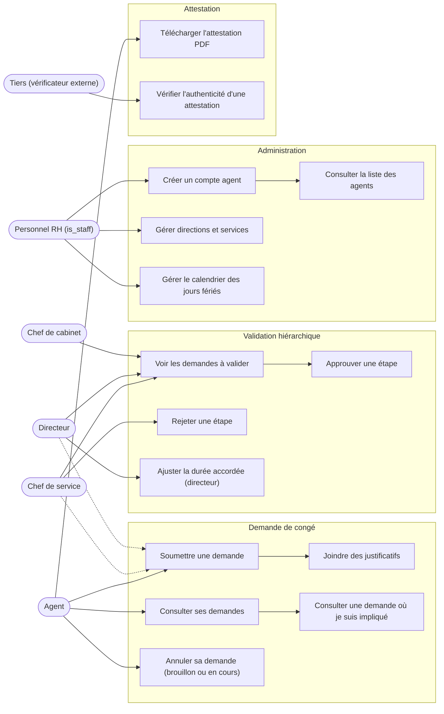
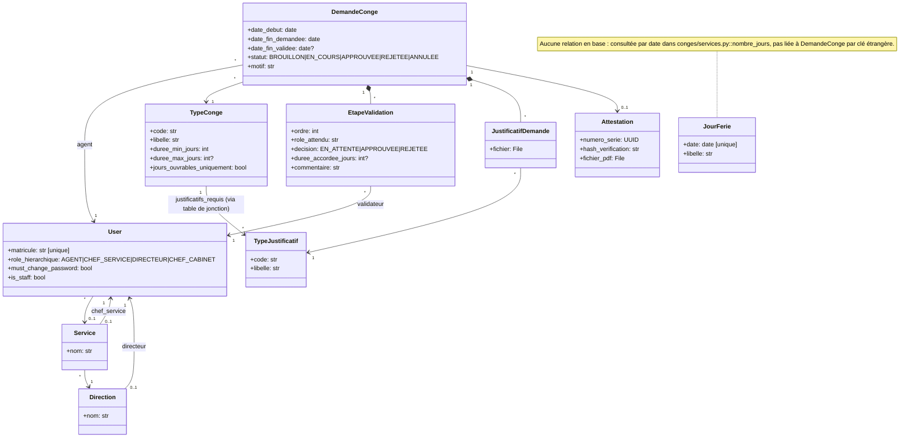
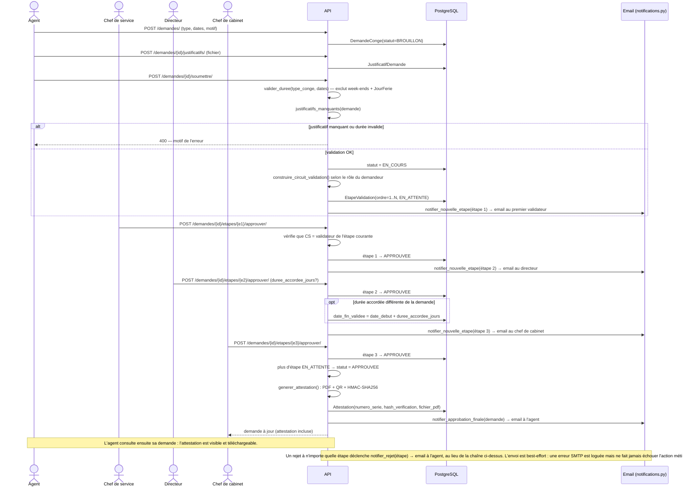
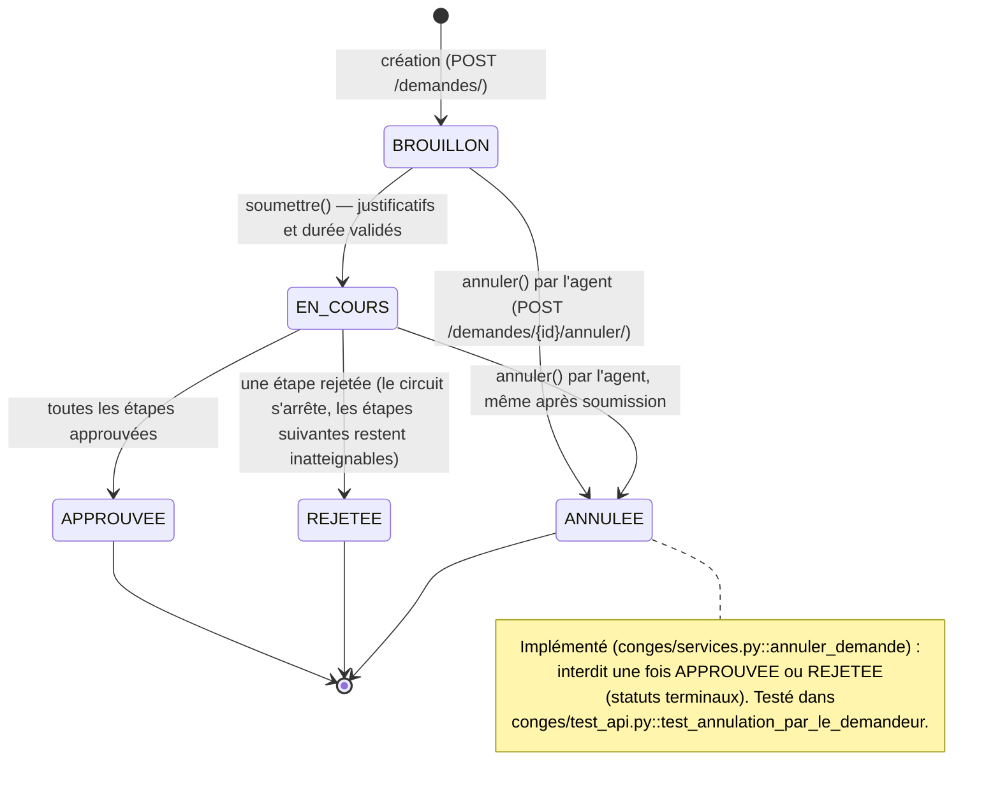
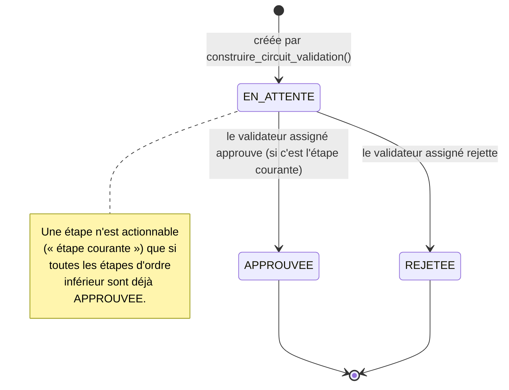

# Diagrammes UML

Diagrammes en Mermaid (rendus nativement par GitHub). Mis à jour le 2026-09-22 pour refléter l'annulation, le calendrier des jours fériés, les notifications et la gestion de l'organisation — la première version de ce document datait d'avant ces fonctionnalités et avait dérivé du code (le diagramme d'état `DemandeConge` affirmait à tort que l'annulation n'était pas atteignable). À maintenir à jour si le modèle change ; un diagramme qui ment est pire que pas de diagramme.

## Cas d'utilisation

## Diagramme de classes (modèle de données)

## Diagramme de séquence — parcours critique

Soumission d'une demande jusqu'à la génération de l'attestation (voir `conges/services.py`, `conges/views.py`).

## Diagramme d'état — cycle de vie d'une `DemandeConge`

## Diagramme d'état — une `EtapeValidation`

